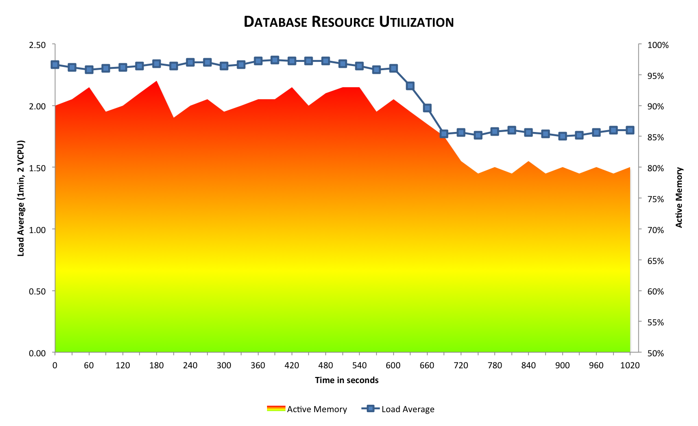
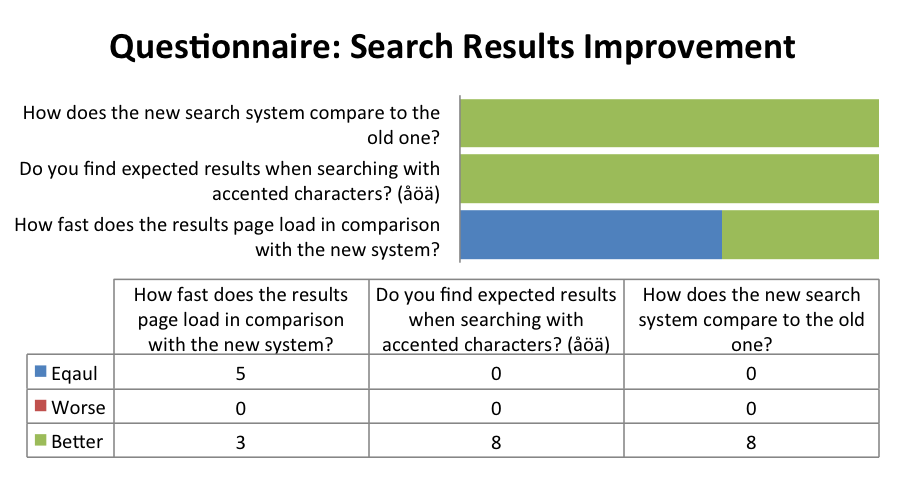

# Voorwoord
Dit is een vertaling van de Engelse versie. Hoewel uiterste zorg is besteed om
ervoor te zorgen dat de informatie in dit document accuraat is en overeenkomt
met de originele Engelse versie, kan ik niet garanderen dat alle, of een deel
van, de verstrekte informatie accuraat is in alle opzichten. De Engelse versie
is leidend, daarom is het aan te raden de Engelse versie te raadplegen in geval
van onduidelijkheden.  
Citaten zijn (vrij) vertaald naar het Nederlands.

# Inleiding
Dit extended abstract documenteert de afstudeerperiode van Twan Wolthof bij
VideofyMe. Het vormt het hoofddocument dat zal worden gebruikt bij de
uiteindelijke waardering van Twan’s afstuderen.

Dit document veronderstelt enige kennis van programmeren, gedistribueerde
systemen, cloud diensten en systeembeheer.

## Afstudeer gegevens
|                             
|:-----------------|:------------
Naam student       | Twan Wolthof
Begeleider         | R. Verheijen van Zuyd Hogeschool
Begeleider         | P. Lef, CTO van VideofyMe
School             | Zuyd Hogeschool
Faculteit          | ICT
Opleiding          | Informatica
Periode            | Augustus 2012 tot en met february 2013

# Afstudeer opdracht
De stage opdracht was niet specifiek. In plaats daarvan was hij tamelijk breed.
Met nieuwe eisen en inzichten werd de opdracht als waren ingekleurd door de tijd
heen.

Gebruikers van VideofyMe vroegen om een betere kwaliteit ten aanzien van de zoek
resultaten. De staf vroeg om een niet-kritische database. Onderzoek toonden aan
dat de zoek opdrachten de database lam legden. Met een toenemend
gebruikersbestand en inefficiënte zoek opdrachten liepen de prestaties van de
database terug. Het doel van de opdracht zou zijn de belasting van de database
te verminderen en de kwaliteit van de zoekresultaten te verbeteren.

VideofyMe besloot om gebruik te maken van Elasticsearch voor een gedistribueerde
full-text zoek omgeving. Gebruikmakend van dit systeem zou de belasting van de
database verlaagd kunnen worden en mogelijkheden bieden om de kwaliteit van de
zoekresultaten te verbeteren.

Tamelijk gauw al wilden investeerders hashtag functionaliteit over het gehele
systeem. Dit was de eerste component die geïmplementeerd moest worden die in
eerste instantie niet was voorzien en zou de opdracht nader specificeren.

De complexiteiten van deze opdracht liggen op het terrein van textuele analyse,
van distributed systemem, van onbekende programmeer omgevingen en frameworks en
culturele verschillen.

# Methode
VideofyMe werkt met ontwikkelingscycli van ongeveer 2 weken. Wanneer het werk
als klaar wordt beschouwd, wordt het in productie genomen, tenzij er reden is om
dit niet te doen. Aan het begin van elke cyclus wort de voorafgaande cyclus
bekeken en wordt niew werk gepland voor de komende cyclus.

Om aan te sluiten bij hun ontwikkelingscyclus werd de keuze gemaakt om een
soortgelijke ontwikkelingscyclus te hanteren. De prioriteit binnen elke cyclus
was als volgt: als eerste, breng verbeteringen aan in de codebase, het ontwerp
en de architectuur en als tweede introduceer nieuwe functies of gedrag. Dez
flexibiliteit en de aard van de opdracht zorgde ervoor dat de opdracht zich in
de loop der tijd geleidelijk aan ontwikkelde en duidelijker werd.

Als eerste zal de architectuur die in gebruik is bij VideofyMe worden besproken
en zullen de nieuwe componenten worden geïntroduceerd. Vervolgens zullen de
veranderingen in de infrastructuur worden besproken en zullen de test resultaten
van de nieuwe infrastructuur worden gepresenteerd. Tot slot zal de discussie
ingaan op how de software is samengesteld van uitbreidbare componenten.

## Elasticsearch
Elasticsearch is een veelheid aan dingen. Het gebruikt Lucene voor full text
zoekopdrachten. Het is schemaloos, document geörieenteerd en een NoSQL
sleutel-waarde opslag. Alles is dynamisch met standaard schalen en omleiding.
Elasticsearch maakt het makkelijk om hoge beschikbaarheid en vrijwel realtime
zoekresultaten te behalen.
Dit alles is toegankelijk via prachtige APIs beschikbaar in meerdere formaten.

### Lucene
Elasticsearch gebruikt full text search.
> Apache Lucene™ is een hoog presterend, volledig uitgeruste tekst zoek machine
  bilbiotheek volledig geschreven in Java. Het is een technology geschikt voor
  bijna iedere applicatie die op tekst wilt zoeken, vooral platform
  onafhankelijk.
> > Van [http://lucene.apache.org/core/](http://lucene.apache.org/core).

Elasticsearch _shards_ documenten gebaseerd op een hash van een unieke
identificatie van het document. Elke shard is een op zich zelf staande lucene
index. Meerdere shards vormen samen een Elasticsearch zoek index. Een index kan
bestaan uit meerdere types. Men zou databases kunnen vergelijken met zoek
indices; shards, pages en partities met shards en lucene-indices and tabellen
met types.

Het aantal shards wordt gespecificeer tijdens de index creatie en is dan
gefixeerd. Het aantal replicas van elke shard kan willekeurig worden gewijzigd.
Er is geen optimaal aantal shards: het is afhankelijk van de eisen van de data.
Het standaard aantal van 5 shards en 1 replica werkt in de meeste gevallen maar
geeft waarschijnlijk niet de beste resultaten voor uw specifieke data. Meer
shards vergroot de indexering prestaties en staat toe om een grote index te
verdelen over meerdere machines. Meer replicas vergroot de zoek prestaties en
verhoogt de beschikbaarheid van de cluster.  
Wanneer het vastgesteld is dat de standaard configuraties niet voldoen niet
passen bij de behoeften, is het van belang dat er een gedegen onderzoek
uitgevoerd wordt om vast stellen wat deze wensen zijn en hoe ze kunnen worden
bereikt. Men dient voorzichtig te zijn wanneer wordt afgeweken.

![Elasticsearch]
[Elasticsearch]: architecture/infrastructure/elasticsearch.png "Grafische weergave van de structuur van een Elasticsearch node in een cluster."

#### Termen
Het ontwerpen van goede schemas ten einde de zoekresultaten te verbeteren
verschilt volstrekt van het ontwerpen van schemas in andere systemen.  In op SQL
gebaseerde opslag media ontwerp je een schema gebaseerd op relaties en types.
Echter wanneer men optimaliseert voor het zoeken op tekst dient men een stap
verder te gaan. Hier is de laagste eenheid een enkelvoudige term. Alle invoer
wordt gereduceerd tot termen, zij het booleaans, numeriek, data gerelateerd of
simpelweg tekst. Het maakt niet uit.

Tekst is speciaal omdat het verschillende betekenissen heeft afhankelijk van de
context. Bijvoorbeeld het formaat, de taal, enige spelfouten en meer kunnen
allemaal potentieel ongewensten verschillen veroorzaken. Dit vereist
zoorgvuldige overweging bij het ontwerpen van een schema. Elasticsearch helpt
door automatisch een scheme af te leiden van de invoer en migreert later
automatisch naar betere schemas. Dit schema is een redelijk beginpunt om de
specifieken behoeften aan toe te voegen zoals ICU (Internationale Componenten
voor Unicode, software die helpt bij het ondersteunen van internationalisatie).

### API
Elasticsearch kan vrijwel volledig worden geconfigureerd terwijl het actief is
via de API. De API is goed gedocumenteerd op de gebruikerswebsite. Het maakt
een veelheid aan nuttige informatie beschikbaar op cluster, node, index of shard
niveau. Er zijn extensies die deze informatie tonen in web gebaseerde GUIs.
Voorbeelden van deze extensies zijn Head, Bigdesk en Paramedic. Al deze werden
gebruikt gedurende de afstudeer opdracht.  
Deze bleken zeer handig te zijn, met name voor het maken van scripts voor de
test resultaten.

#### Querie DSL
Elasticsearch implementeert een bijzonder mooie domein specifieke taal (DSL) om
zoekopdrachten te maken.  
Gebruikmakend van eenvoudige te begrijpen composieten is het mogelijk om
zoekopdrachten te creëren op maat gemaakt voor de data en usecases. De DSL heeft
constructies zoals `bool`, `range`, `query-string` en meer. Tijdens de afstudeer
periode heb ik verschillende van deze queries geconstrueerd alsmede een
abstractie laag gemaakt voor de algemene structuur van de queries.

#### Overige API componenten
Elasticsearch verschaft ook informatie de omgeving waarbinnen het opereert. Het
belangrijke _endpoint_ is `/`; een snel kort bericht dat aangeeft dat of alles
`OK` `200`, of nader onderzoek vereist. Andere API componenten omvatten:
_Health_, _Stats_, _Nodes Info_ en meer. Samen verschaffen zij een volledig
overzicht van de cluster, nodes binnen de cluster en de omgeven van
Elasticsearch zelf.

### Tire
Videofyme heeft gekozen om Tire als client-bibliotheek te gebruiken voor de
aanvang van mijn afstuderen. Ten tijden van deze beslissing was dit de enige
Ruby client. Het voorziet in dezelfde Querie DSL die Elasticsearch ook
verschaft maar in een Ruby DSL. Daarom is het in essentie een _wrapper_, het
verifieert de invoer niet.

#### Het testen van het systeem.
De infrastructuur is getest, details zijn genoteerd in de test resultaten.
Aangezien de oude infrastructuur onveranderd is gebleven werden alleen de nieuwe
componenten getest. Ik heb mijn _musings_ genoteerd.

De nieuw geschreven code voor de afstudeer opdracht werd geünit-test met behulp
van `rspec` en `rr`. De prestaties van de database werden vastgesteld door de
systeembeheerder te ondervragen. Verbeteringen in de kwaliteit van de zoek
resultaten werden vastgesteld door een enquete gehouden onder de medewerkers van
VideofyMe. De resultaten zullen worden gepresenteerd in het volgende hoofdstuk.

# Resultaten
Dit onderdeel gaat verder op de resultaten van mijn stage en de huidige status
van mijn werk bij VideofyMe.

## Infrastructuur
Onderstaand is een diagram van de oude infrastructuur van VideofyMe. Ten einde
te voorkomen dat het diagram te druk zou worden zijn caching lagen en andere
tijdelijke opslag system weggelaten.

![old infrastructure]
[old infrastructure]: architecture/infrastructure/old.png "De Oude infrastructuur zoals gebruikt bij VideofyMe."

&nbsp;&nbsp;&nbsp;&nbsp;&nbsp;Component   | Beschrijving
-----------:|:-------
Web         | Gebruikers systemen.
Frontend    | Webserver, gebruikt de OpenAPI voor data.
OpenAPI     | Wrapper voor de API. Benaderd door iframe-embeds, iPhone & Android applicaties.
Redis       | Snelle betrouwbare gedistribueerde sleutel-waarde opslag.
Redis Slave | Lokale redis instantie, gesynchronizeerd met de master.
Uploader    | Accepteert video uploads van gebruikers en persisteer deze op op S3.
S3 (topleft)| Video en thumbnail opslag.
API         | Bevat bedrijfslogica.
SQL         | Relationele data opslag.
Adserver    | Houdt het aantal views bij en beslist wanneer advertenties getoont worden. Persisteert logs naar S3.
S3 (right)  | Logboek opslag.
Mapreduce   | Doorloopt het logboek voor het aantal views en update de betalingen en credits.

Voor de nieuwe infrastructuur die tenminste een Elasticsearch cluster zou
toevoegen waren verschillende opties beschikbaar. Deze werden allemaal extensief
getest, zoals beschreven in de test resultaten. Met de kennis van de inofrmatie
verzameld in deze tests werd de keuze gemaakt om een installatie met 
Elasticsearch nodes op iedere API instantie om te voorzien in caching en cluster
ontdekking.

> …Elasticsearch dient te opereren op tenminste de heflt van de client nodes …
  het nog steeds de meest kostende optie: geheugen is gemeten per node en niet
  per cluster. Onafhankelijk hiervan, zijn de voordelen die deze manier biedt —
  met name automatische cluster ontdekking, routing en eenvoud van configuratie
  — vele malen groter dan de reductie in geheugen wanneer men kiest voor HAProxy
  of Nginx.
> > Van [architecture/musings.html](architecture/musings.html) — Twan Wolthof

![small infrastructure]
[small infrastructure]: architecture/infrastructure/small.png "Een detailweergave van de relevante componenten in de nieuwe infrastructuur."

## Huidige status
De voorgestelde infrastructuur is goedgekeurd. Tijdens het ingebruiknemen van de
nieuwe infrastructuur stond Amazon Web Services (AWS) het niet toe om nieuwe
instantie te maken. Dit bleek geen obstakel te zijn. Een reeds bestaande
instantie werd hergebruikt voor de cluster. Dit zorgde ervoor dat de cluster
in een gereduceerde modus van redundantie was, maar bleef volledig operationeel.

## Database
Met de Elasticsearch cluster operationeel is het mogelijk om de datase te
ontlasten. Om hier voordeel van te hebben is de VideofyMe API geüpdate. In
essentie zijn de duurste resources gebruikende queries ontlast door deze te
verplaatsen naar een ander systeem.

Onderstaand is een diagram van de afname in systeem resources gebruikt en
gemeten rond de tijd van de ingebruikname.

Metriek       | Beschrijving
-------------:|:-------
Load Average  | Het aantal processen (computaties) klaar voor berekening, gemeten in een exponentieel gewogen gemiddeld over de laatste minuut gemeten iedere vijf seconden.
Active Memory | Het geheugen dat actief wordt (her-)gebruikt. Omvat alle geheugen anders dan data, programma code en caches.

De database instantie heeft 2 VCPUs (virtual central processing units). Een
_Load Average_ van boven de 2 is derhalve zeer zorgwekkend. De afname in
benutting van de resources is duidelijk te zien rond de 10 minuten markering.
Hoewel dit nog steeds een zware belasting is, geeft enige ruimte. Dit is
buitengewoon behulpzaam omdat het toe staat om secundaire taken uit te voeren op
de database zonder deze lam te leggen. Een voorbeeld van een dergelijke actie is
het exporteren van een backup.

## Kwaliteit van de zoekresultaten
De kwaliteit van de zoekresultaten kunnen worden niet gemeten in concrete
waarden of eenheden. De uitkomst van de enquete zal vaststellen of het nieuwe
systeem de kwaliteit van de zoekresultaten heeft verbeterd. De enquete werd
verspreid onder de medewerkers van VideofyMe, aangezien hun extensief gebruik
van de dienst nauw het gebruik van de gebruikers reflecteert.

Vragen in de enquete werden op een driepunts-schaal beantwoord: gelijk,
slechter of beter. De resultaten een duidelijk bevestiging dat het nieuwe zoek
systeem inderdaad een verbetering is.

# Conclusie
VideofyMe was meer dan tevreden opgeleverde producten tijdens mijn afstudeer
periode. Zij besloten om mij een betrekking aan te bieden bij mijn terugkeer
naar Zweden.  
Met een sucessvolle aflevering van producten tijdens mijn afstuderen, is het
systeem reeds in productie genomen. Hierdoor ben ik tevreden met mijn
succesvolle afstudeer periode.

## Tekort komeningen en niet behaalde resultaten
+ **Tire**  
  Er waren enkele ideeën over het uitbreiden van Tire (client bibliotheek voor
  Elasticsearch) om automatisch de cluster ontdekken. Hiervan is vastgesteld dat
  het zeer complex is en dit zou een afhankelijkheid toevoegen aan een derde
  partij. Echter, het blijkt een betere lange termijn oplossing te zijn
  aangezien een reductie mogelijkmaakt in het geheugen gebruik.
+ **Data redundantie**  
  Naast het feit dat data ook is opgeslagen in de SQL database, is de data voor
  het zoeken niet redundant beschikbaar. Dit omdat AWS het niet toe liet om
  nieuwe instanties aan te maken voor de Elasticsearch Cluster.

## Extensies
VideofyMe is doende een overeenstemming te bereiken met een derde partij die
videos analyseert voor winkel producten. Gebruikers zouden dan op videos kunnen
zoeken die bepaalde producten bevatten, bijvoorbeeld mascara. Het nieuwe systeem
zou kunnen worden uitgebreid met deze functionaliteit. Vanwege het nieuwe
systeem, waarvan de structuur bewezen heeft makkelijk uitbreidbaar te zijn,
vereist dit geen significante inspanning.

## Aanbevelingen
Het is zeker aan te raden om de installatie te voltooien door tenminste een
additionele, supplementaire Elasticsearch node toe te voegen op een seperate
instantie. Dit zou de beschikbaarheid en betrouwbaarheid van het zoeksysteem
aanmerkelijk vergroten.

Afhankelijk van de prestatie resultaten van de cluster in productie, is het
misschien verstandig om de geheugen capaciteit te vergroten van de instanties.
Dit zou tevens mogelijk maken om meerinformatie te indexeren zadat de zoek
qualiteit verbeterd.

## Erkenningen
Ik zou graag mijn begeleiders, R. Verheijen en P. Lef, willen bedanken voor hun
begeleiding en advies gedurende mijn afstudeerstage. Ik zou ook graag alle
mederkers van VideofyMe willen bedanken voor hun ondersteuning en
aanmoedigingen.  
Mijn dank gaat ook uit naar mijn vrienden en familie voor hun constante
aanmoediging en proeflezingen. In het bijzonder zou ik J. Willenborg willen
bedanken die mijn heeft geholpen, zelfs gedurende moeilijke persoonlijke
omstandigheden, voor zijn expertise en snelle reacties op vragen.  
Ik moet ook iederen bedanken in #ruby en #elasticsearch op Freenode voor hun
steun en bereidwilligheid om kennis en ervaring met mij te delen. Met name
S. Rusterholz and C. Gormley voor hun vriendelijkheid en expertise in
respectievelijk #ruby and #elasticsearch. Ik zou ook graag C. Gormley willen
bedanken voor het aanbieden van extra, nog niet gepubliceerd lees materiaal
met betrekking tot Elasticsearch.  
Ik wens mijn dank uit te drukken naar Karolina, mijn vriending, voor haar
voortdurende steun en aanmoediging. Ik was voortdurend verbaasd voor haar
bereidwilligheid om mijn documenten te proeflezen terwijl ze ook alle ups and
downs gedurende mijn afstudeerstage mee maakte.

# Referenties
Zie de engelse versie voor referenties en vernoemingen van gebruikte materie.
