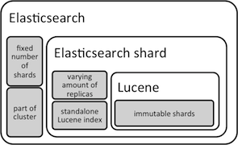

<!--
Using http://blackboard.hszuyd.nl/bbcswebdav/courses/HIO-IT4-I4-I8-stage-afstuderen/Documenten/Docs_Afst_Stage/SE/ExtendedAbstractStageEnAfstuderen.pdf as a reference.
-->

# Introduction
This extended abstract documents the internship period of Twan Wolthof at
VideofyMe. It forms the main document that will be used in the final assessment
of Twan's graduation.

This document assumes *some* knowledge of programming, distributed systems,
cloud services and system administration.

## Internship details
|                             
|:-----------------|:------------
Name student       | Twan Wolthof
Supervisor         | R. Verheijen from Zuyd University
Supervisor         | P. Lef, CTO of VideofyMe
University         | Zuyd University of Applied Sciences
Faculty            | ICT
Degree Programme   | Information Technology
Period             | August 2012 through February 2013

<!-- I repeatedly asked if this section was supposed to be included,
  it was not. However, due to the technical level of this document it might be
  smart to include a 'primer'. -->
<!-- # Abstract -->

<!-- discuss people? -->

<!-- ## Test Results: I think the location for this node is weird. -->
<!-- Theoretic framework: I think the location for this node is weird.
                          It fits better in the next sections. -->

# Internship assignment
The internship assignment was not specific. Instead it was quite broad.
It transformed over time based on new requirements and insight.

Users of VideofyMe requested higher quality search results. Staff requested
a non-critical database. Investigation showed that the search queries were
crippling the database. With a growing userbase and inefficient search-queries the database
suffered in performance. The goal of the assignment would be to decrease the
strain on the database and improve the quality of the search results.

VideofyMe decided to use Elasticsearch for a distributed full-text search
environment. Using this system, the strain could be removed from the database
and open up possibilities to improve the quality of the search results.

<!-- This paragraph below is in wrong tense. It is also in the wrong place -->
<!--
The first day at work Patrick hooked me up with some hook-in points in the
code and gave me a tour around the code. I had previously already set up my ruby
environment to be compatible with theirs, so I went on scouring their code.
Details about my first impressions can be found in my [status reports] and
[memos].
-->

Quite early on investors wanted hashtag functionality across the board. This was
the first component to be implemented that was not initially anticipated and
would further specify the assignment.

The complexities of this assignment are to be found in areas of textual analysis,
of distributed systems, of unknown programming environments and frameworks, and
cultural differences.

# Method
VideofyMe works with development cycles of around 2 weeks. When work is
considered done it gets deployed to production, unless there is a desire not to do
so. At the start of each cycle the previous cycle is reviewed and new work is
scheduled.  
To fit in with their development cycle, the choice was made to develop according
to a similar [development cycle]. The priority within each cycle was as follows:
first improve the codebase, design and architecture and secondly introduce new
features or behavior.  
This flexibility and the nature of the assignment caused the assignment to evolve
over time and become clearer.

To start with, the important systems and subjects will be discussed. Next, the
manner in which these have been tested will be defined. And finally, the
results will be presented.

<!-- Somehow have to incorporate these things:
# Work environment

+ Abroad
+ Working with distributed software
-->

<!-- Describe that the systems below have been studied to meet the complexity -->

## [Elasticsearch]
Elasticsearch is a lot of things. It uses Lucene for full text search. It is
schema free, document oriented and a NoSQL key-value store. Everything is
dynamic with out of the box scaling and failover. High availability and near
realtime search results are easily attained.  
This is all accessible through beautiful APIs available in multiple formats.

### [Lucene]
Elasticsearch uses Lucene for full text search.
> Apache Lucene™ is a high-performance, full-featured text search engine library
  written entirely in Java. It is a technology suitable for nearly any
  application that requires full-text search, especially cross-platform.
> > From [http://lucene.apache.org/core/](http://lucene.apache.org/core).

<!-- Some terms are unclear in the below paragraph. -->
Elasticsearch shards documents based on a hash of a document's unique
identifier. Each shard is a standalone Lucene-index. Multiple shards make up
a search-index in elasticsearch. An index can have multiple types. One could
compare databases to search indices; shards, pages and partitions to shards and
lucene-indices and tables to types.

The number of shards is specified during index creation and then fixed. The
number of replicas of each shard can be changed at will.  
There is no optimal number of shards: it is dependent on the requirement of your
data. A default of 5 shards and 1 replica works for most cases but probably
won't give you the best results for your particular data. Having more *shards*
enhances the _indexing_ performance and allows to _distribute_ a big index
across machines. Having more *replicas* enhances the _search_ performance and
improves the cluster _availability_.  
When it has been determined that the defaults don't suit your needs, it is
important to conduct a proper investigation into what those needs are and how
they can be accomplished. One should be careful when deviating from these
defaults.

#### Terms
Designing good schemata to optimize your search results is completely different
than designing schemata in other systems. In SQL based stores you design a scheme
based on relationships and data types. However, when optimizing for text search,
you have to go one step further. Here the lowest denominator is a single `term`.
All input gets reduced to terms, whether it is boolean, numeric, date related or
just text. It doesn't matter.

Text is special because it means different things depending on its context.
For example the format, the language, any spelling errors and more can all cause
potentially unwanted differences.
This requires careful consideration when designing a scheme. Elasticsearch helps
you by automatically guessing a scheme based on first input, and migrates to
better schemes automatically later on. This scheme is a good starting point to
attach your specific needs like [ICU](https://en.wikipedia.org/wiki/International_Components_for_Unicode)
(International Components for Unicode, software supporting internationalization).

### [API]
Elasticsearch can be configured almost completely while running via the API.
The API is well documented at the [community website][Elasticsearch]. It reveals
a multitude of useful information on the cluster, node, index or shard level.
There are plugins that make this information available in web based GUIs.
Examples of these APIs are [Head], [Bigdesk] and [Paramedic]. All of these were
used for the internship assignment.  
These proved especially helpful as a guide to create scripts for the
[test results].

#### [Query DSL]
Elasticsearch implements a really nice domain specific language (DSL) to query
the index. The heading of this paragraph links to the official documentation.  
Using simple to understand composites it is possible to create queries tailored
for your data and usecases. The DSL has constructions like `bool`, `range`,
`query-string` and more. During the internship I constructed several of these
queries as well as built an abstraction for the common structure for queries.

#### [Other API components]
Elasticsearch also provides information about the environment it runs on. The
most important endpoint is `/`; a quick small message that either tells you
everything is `OK` `200` or requires further investigation. Other API components
include Health, Stats, Nodes Info and more. Together they provide a complete
overview of the cluster, nodes on the cluster and the environment of
Elasticsearch itself.

### [Tire]
VideofyMe chose to use this client before the start of my internship. At the
time of this decision this was the only ruby client. It provides the same Query
DSL that Elasticsearch provides, but in a Ruby DSL. Therefore it is essentially
a wrapper, it does no input validations.

## Testing the system
The infrastructure has been tested, details have been written down in the
[test results]. As the old infrastructure itself has remained unchanged only the
new components were tested. I have written down my [musings].

The newly written code for the internship assignment was unit-tested using
[rspec] and [rr]. Database performance was determined by questioning the system
administrator. Improvements in quality of the search results were determined by
a questionnaire held among VideofyMe employees. Results will be presented in the
next chapter.

# Results
This section elaborates on the results of my internship and the current status
of my work at VideofyMe.

## Infrastructure
Below is a diagram of the old infrastructure of VideofyMe. To keep the diagram
from becoming crowded, caching layers and other temporary storage systems have
been omitted.

![old infrastructure]

&nbsp;&nbsp;&nbsp;&nbsp;&nbsp;Component   | Description
-----------:|:-------
Web         | Contains user facing systems.
Frontend    | Webserver, uses the OpenAPI for data.
OpenAPI     | Wrapper for API. Accessed by iframe-embeds, iPhone & Android applications.
Redis       | Fast reliable distributed key-value store.
Redis Slave | Local redis instance synchronized with master.
Uploader    | Accepts video uploads from users and persists them to S3.
S3 (topleft)| Video and thumbnail storage.
API         | Contains business logic.
SQL         | Relational data storage.
Adserver    | Keeps track of views and decides when and which ads to serve. Persists logs to S3.
S3 (right)  | Logfile storage.
Mapreduce   | Parses the logfiles for views and updates payments and credits.

For the new infrastructure which would add at least an Elasticsearch cluster,
several options were available. All were extensively tested, as documented
in the [test results]. With the knowledge of the information gathered in these
tests, the choice was made to use a setup with Elasticsearch nodes on each API
instance to provide caching and cluster discovery.

> …Elasticsearch has to run on at least half the client-nodes … it
is still the most costly option: memory is measured per node and not per
cluster. Regardless of this, the benefits that this setup provides — most
notably automatic cluster discovery, routing and ease of configuration — far
exceed the reduction in memory when choosing HAProxy or Nginx.
> > From [architecture/musings.html](architecture/musings.html) — Twan Wolthof

![small infrastructure]
[small infrastructure]: architecture/infrastructure/small.png "A highlight of the relevant components in the new infrastructure."
[old infrastructure]: architecture/infrastructure/old.png "The old infrastructure as used at VideofyMe."

## Current status
The proposed infrastructure has been approved. While deploying the new
infrastructure, Amazon Web Services (AWS) did not allow the creation of
additional instances. This turned out not to be a deal breaker. An existing
instance has been re-used to deploy on. This put the cluster in a mode of
reduced redundancy but remains fully operational.

## Database
With the Elasticsearch cluster operational, it can take the strain off the
database. To achieve this, the VideofyMe API also received an update to take
advantage of the Elasticsearch cluster. In essence the three most resource
expensive queries on the database have been offloaded to another system.  
<!-- I have a chart of the resource consumption of these queries. I am not
including that chart because it adds little to no extra value to this paragraph. -->
Below is a chart of the drop in system resources utilized, measured around the
time of deployment.

Metric        | Description
-------------:|:-------
Load Average  | The number of processes (computations) ready to run, measured in an exponentially weighted average over the last minute sampled every 5 seconds.
Active Memory | The memory actively being (re-)used. Includes all memory other than data, executable memory and caches.

The database instance has 2 VCPUs (virtual central processing units). A load
average of above 2 is therefore **very concerning**. The drop in resource
utilization can be seen clearly around the 10 minute mark. While this is still a
heavy utilization, it does give some leeway. This is extremely helpful
because it allows for secondary operations to be done with the database without
crippling performance. An example of such a secondary operation is exporting a
backup of the database.

## Quality of search results
The quality of search results cannot be measured in concrete values or units.
The outcome of the questionnaire will determine whether the new system has
improved on the quality of search results. The questionnaire was distributed
amongst Videofyme employees, as their extensive use of the service closely
reflects that of the actual userbase.

<!-- is it necessary to include the chart here? -->

Questions in the questionnaire were answered on a 3 point scale: equal, worse or
better. The results give a clear confirmation that the new search system is
indeed an improvement.
<!-- While quite short it packs a lot of opinion about the search system. -->

# Conclusion
VideofyMe was more than satisfied with the products delivered during my
internship period. They decided to offer me employment on my return to Sweden.  
With the successful delivery of products during my internship, the system has
already been deployed to production. Because of this, I am pleased with my
successful internship.

## Unfinished or incomplete work
+ **Tire**  
  There were some thoughts about extending Tire (client library for
  Elasticsearch) to automatically discover the cluster. This was determined to
  be very complex and would add a dependency on a third party. However, it
  appears to be a better long-term solution as it allows for a decrease in
  resource utilization.
+ **Data redundancy**  
  Besides the fact that all data is also stored in a SQL store, the data used
  for searching is not redundantly available. This is because AWS did not
  authorize the request for new instances to use for the Elasticsearch cluster.

## Extensions
VideofyMe is in the process of making an agreement with a third party that
analyzes videos for shopping materials. Users could then search for videos
involving certain, say, styling products. The new system could be extended with
this functionality. Because of the new system, whose structure has proven to be
easily extensible, this does not require significant effort.

## Recommendations
It is definitely recommended to complete the deployment by adding at least one
additional, supplementary Elasticsearch node on a seperate instance. This would
greatly increase the availability and reliability of the search system.

Depending on the performance results of the cluster on production it might be
wise to increase the memory capacity of the instances. This would also allow
indexing additional data to improve search quality.

## Acknowledgements
I would like to thank my supervisors, R. Verheijen and P. Lef, for their
guidance and advice during my internship. I would also like to thank all
employees at VideofyMe for their support and encouragement.  
My gratitude also goes to my friends and family for their constant encouragement
and proofreading. In particular I would like to thank J. Willenborg who helped
me, even during difficult personal times, for his expertise and prompt responses
to my questions.  
I also have to thank everyone in #ruby and #elasticsearch on Freenode for their
support and their willingness to share their knowledge and experience with me.
In particular S. Rusterholz and C. Gormley for their friendliness and expertise
in #ruby and #elasticsearch respectively. I would also like to thank C. Gormley
for providing me with extra, yet unpublished reading material regarding
Elasticsearch.  
I wish to express my gratitude to Karolina, my girlfriend, for her continued
support and encouragement. I was continually amazed by her willingness to
proofread my documents while also experiencing all the ups and downs during my
internship period.  

## References
+   [development process]
+   [graduation assignment]
+   [memos]
+   [performance plan]
+   [status reports]
+   [time management]
+   [architecture/design]
+   [architecture/requirements]
+   [architecture/musings]
+   [architecture/test results]
+   [reflections]

[test results]: architecture/test-results.html
[status reports]: status-reports.html
[memos]: memos.html
[graduation assignment]: graduation-assignment.html
[development process]: development-process.html
[development cycle]: development-process.html
[musings]: musings.html
[performance plan]: performance-plan.html
[status reports]: status-reports.html
[time management]: time-management.html
[architecture/design]: architecture/design.html
[architecture/requirements]: architecture/requirements.html
[architecture/musings]: architecture/musings.html
[architecture/test results]: architecture/test-results.html
[reflections]: reflections.html

## Other used materials
+ **The Elasticsearch book**; the official book; as yet unpublished material from [Elasticsearch.com]
+ SQL turns NoSQL at large scale
  - [mysql is facebook scale so-why use nosql — Pandawhale]
  - [Why does Quora use MySQL as the data store instead of NoSQLs such as Cassandra MongoDB or CouchDB — Quora]
  - [friendfeed uses schemaless mysql — backchannel]
+ [Managing large sharded topologies]
+ [Scheme vs Schema](http://lmddgtfy.net/?q=Scheme%20vs%20Schema)
+ [Additional vs Supplementary](http://lmddgtfy.net/?q=Additional%20vs%20Supplementary)
+ [Introduction to distributed systems]
+ [Webuild — blog post about elasticsearch]
+ [Elasticsearch pre-flight checklist]
+ [Sharding is hard]
+ [Introductory video about elasticsearch]
+ [Introduction to architecting systems for scale]

[Elasticsearch]: http://elasticsearch.org
[Elasticsearch.com]: http://elasticsearch.com
[API]: http://www.elasticsearch.org/guide/reference/api/index.html
[Query DSL]: http://www.elasticsearch.org/guide/reference/query-dsl/index.html
[Other API components]: http://www.elasticsearch.org/guide/reference/api/
[Lucene]: http://lucene.apache.org/core/
[Tire]: http://karmi.github.com/tire/
[Head]: http://mobz.github.com/elasticsearch-head/
[Bigdesk]: http://bigdesk.org
[Paramedic]: https://github.com/karmi/elasticsearch-paramedic
[rspec]: http://rspec.info
[rr]: https://github.com/btakita/rr

[Introduction to architecting systems for scale]: http://lethain.com/introduction-to-architecting-systems-for-scale/
[Introductory video about elasticsearch]: http://www.elasticsearch.org/videos/2012/06/05/three-nodes-and-one-cluster.html
[mysql is facebook scale so-why use nosql — Pandawhale]: http://pandawhale.com/convo/383/mysql-is-facebook-scale-so-why-use-nosql
[Why does Quora use MySQL as the data store instead of NoSQLs such as Cassandra MongoDB or CouchDB — Quora]: http://www.quora.com/Quora-Infrastructure/Why-does-Quora-use-MySQL-as-the-data-store-instead-of-NoSQLs-such-as-Cassandra-MongoDB-or-CouchDB/answers/39928
[friendfeed uses schemaless mysql — backchannel]: http://backchannel.org/blog/friendfeed-schemaless-mysql
[Managing large sharded topologies]: http://www.percona.com/files/presentations/percona-live/nyc-2012/PLNY12-managing-large-sharded-topologies-jetpants.pdf
[Elasticsearch pre-flight checklist]: http://asquera.de/opensource/2012/11/25/elasticsearch-pre-flight-checklist/
[Introduction to distributed systems]: http://www.somethingsimilar.com/2013/01/14/notes-on-distributed-systems-for-young-bloods/
[Webuild — blog post about elasticsearch]: http://webuild.envato.com/blog/moving-the-marketplaces-to-elasticsearch/
[Sharding is hard]: http://highscalability.com/blog/2010/10/15/troubles-with-sharding-what-can-we-learn-from-the-foursquare.html
